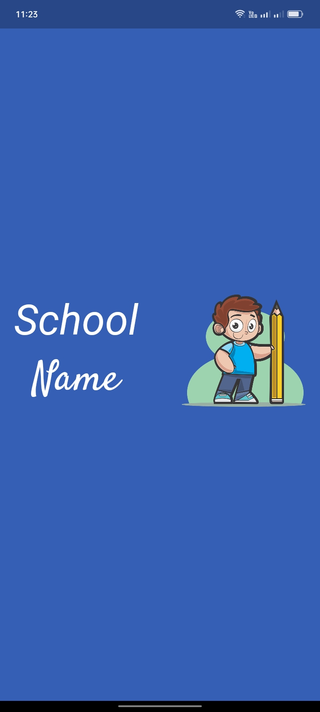
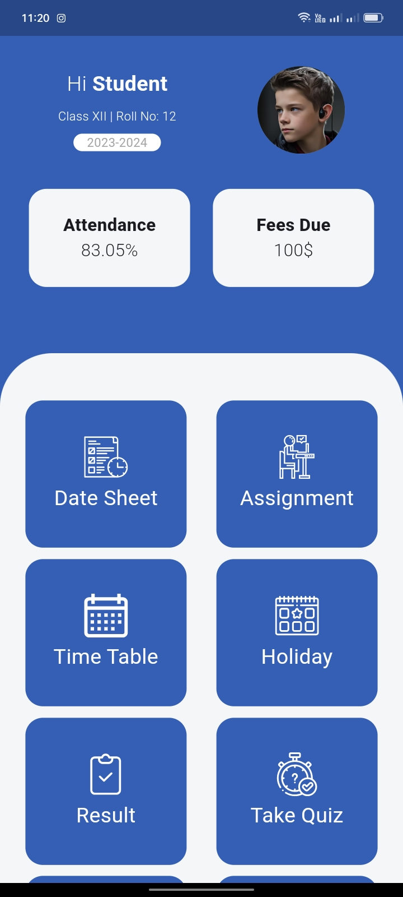
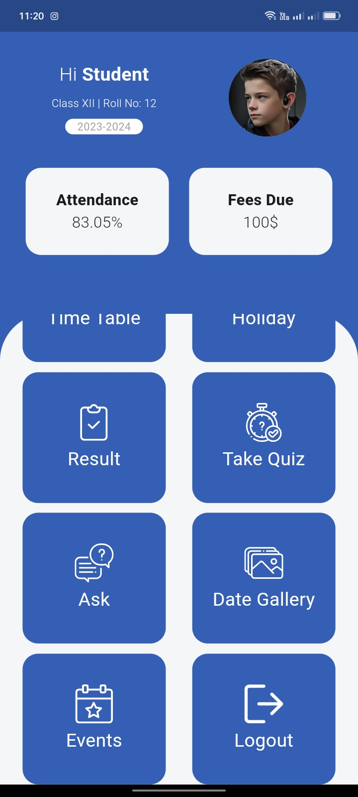
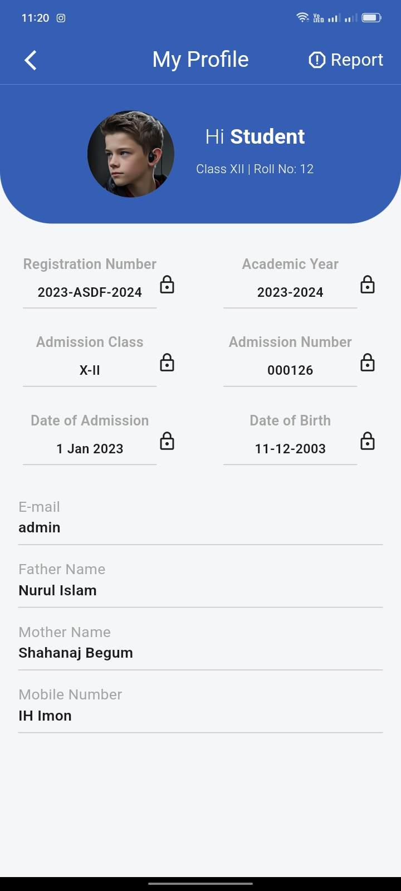
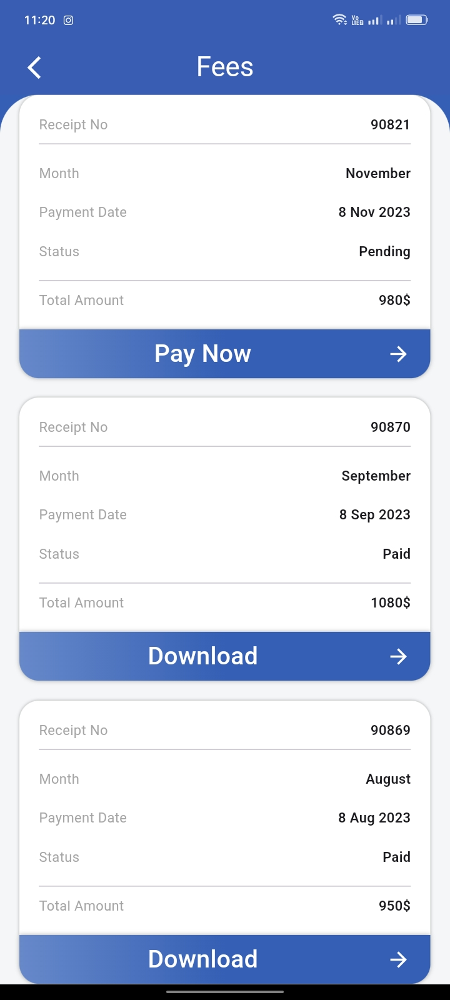
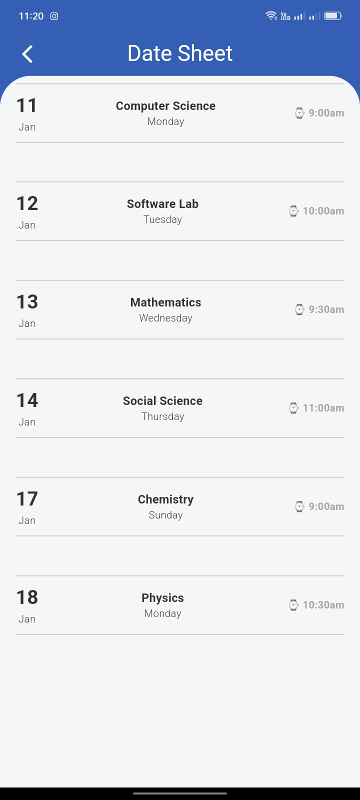
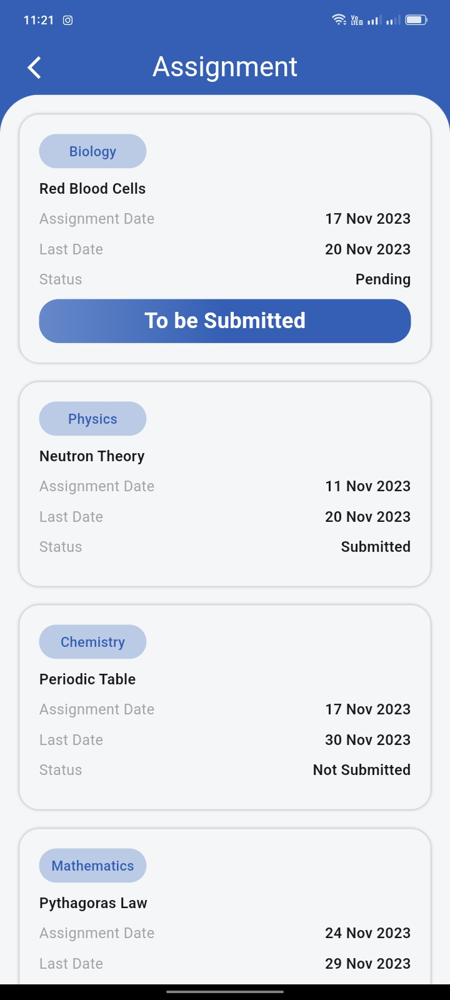

# Covid Tracker Apps Based on API

## This are the all screen of this app

<h2 style="color: red">This is only User Interface based application</h2>

<h3>Loading Screen</h3>

<h3>Home Screen 1</h3>

<h3>Home Screen 2</h3>

<h3>Profile Screen</h3>

<h3>Payment Screen</h3>

<h3>Date Sheet Screen</h3>

<h3>Date Sheet Screen</h3>

<h3>Assignment Screen</h3>

